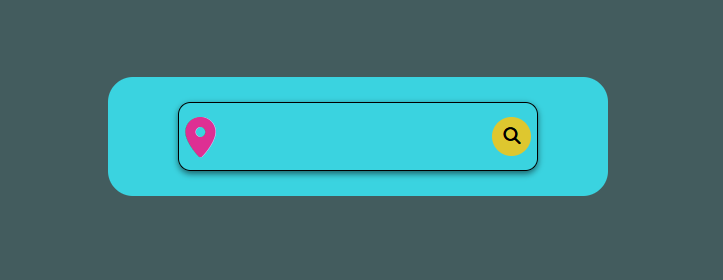
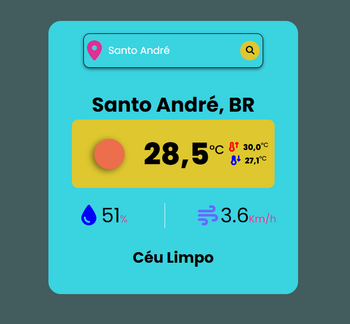

# Clima de Agora

**API USADA** : [Open Weather](https://openweathermap.org/current?collection=current_forecast)

Uma interface que mostra o clima de uma cidade, contendo informações como:
- Temperatura Atual.
- Temperatura Máxima.
- Temperatura Mínima.
- Uma imagem representando o clima atual.
- Umidade.
- Velocidade do Vento.

O objetivo desse projeto é praticar a consumir uma API e integrar as informações em uma interface simples de HTML e CSS. A API foi escolhida por ser gratuita e pela possibilidade de fazer um projeto mais profissional.

## CSS Nestin:
Neste Projeto, decidi usar o CSS Nestin, que tem uma estrutura parecida com o do HTML. <br/><br/>
**Exemplo**: 
```CSS
.container {
    width: 50px;
    height: 50px;
    background-color: red;

    &:hover {
        background-color: blue;
    }
}
```

## Imagens de como está o projeto Atualmente
Tela antes de pesquisar a cidade

<br/>
Tela quando pesquisada a cidade
